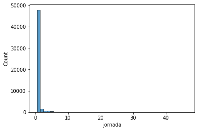
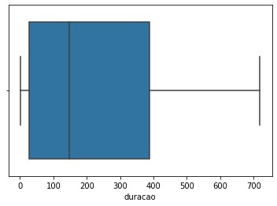
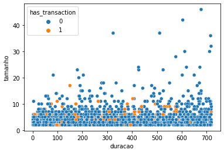
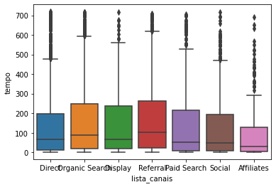
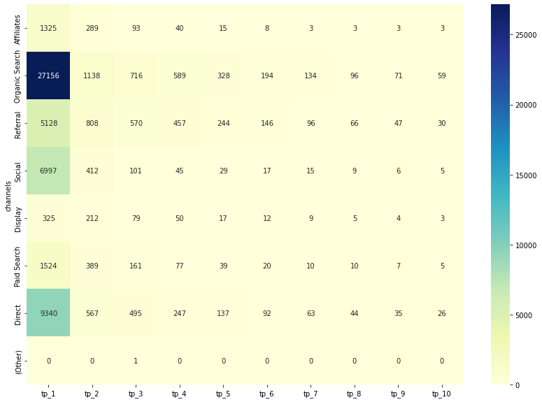

## O que é a Jatoolbox ?

  No contexto da DP6 é comum lidarmos com uma base de dados para atribuição que apresentas jornadas no formato 'A > B > C', em que as jornadas são representadas por uma string em que os pontos de contato de um usuário são representados por substrings separados por ' > ', na ordem em que aconteceram, da esquerda para a direita. 

  Análisar essas funções pode se tornar tedioso e trabalhoso, uma vez que para extrair informações relevantes das mesmas é necessário criar uma combinação de funções muitas vezes repetitivas, baseadas em splits, contagens de elementos, combinações, etc. 

  Nesse cenário, a Jatoolbox (Journey Analisys Toolbox) é uma classe implementada em Python, que deve ser encarada como um conjunto de ferramentas úteis para análise de jornadas. Nos métodos da classe o usuário irá encontrar funções prontas e frequentemente úteis para extrair informações das jornadas. Na sessão a seguir serão apresentados alguns exemplos práticos.

## Usando a Jatoobox em alguns exemplos práticos


### Instalação e import da biblioteca

As seguintes linhas de código irão instalar e importar a Jatoolbox


```python
#instalação
!pip install Jatoolbox
```

    Collecting Jatoolbox
      Downloading JATOOLBOX-0.0.2-py3-none-any.whl (6.1 kB)
    Installing collected packages: Jatoolbox
    Successfully installed Jatoolbox-0.0.2
    


```python
#import
from jatoolbox import jatoolbox as jt
```

Com a linha abaixo, o usuário irá instanciar um objeto da classe Jatoolbox, e a partir dele terá acesso a todos os métodos (funções) da classe:


```python
#instanciando um objeto analisador
an = jt.JAToolbox()
```

### Import dos dados


```python
import seaborn as sns
import matplotlib.pyplot as plt
```


```python
import pandas as pd

base = 'https://raw.githubusercontent.com/DP6/customer-journey-analysis-toolbox/main/base_demonstracao.csv?token=ATC3AU2LXPVSV6B5F6G3GU3BRF35G'

df = pd.read_csv(base, index_col=0)
df.reset_index(inplace = True)

```


```python
df.head()
```


<div>
<style scoped>
    .dataframe tbody tr th:only-of-type {
        vertical-align: middle;
    }
    .dataframe tbody tr th {
        vertical-align: top;
    }
    .dataframe thead th {
        text-align: right;
    }
</style>
<table border="1" class="dataframe">
  <thead>
    <tr style="text-align: right;">
      <th></th>
      <th>id_jornada</th>
      <th>id_usuario</th>
      <th>horario_ultima_sessao</th>
      <th>jornada</th>
      <th>tempo_para_conversao</th>
      <th>transacoes</th>
      <th>receita</th>
      <th>has_transaction</th>
    </tr>
  </thead>
  <tbody>
    <tr>
      <th>0</th>
      <td>00576442052177483560_0</td>
      <td>0057644205217748356</td>
      <td>2017-07-19T00:09:34Z</td>
      <td>Display</td>
      <td>0</td>
      <td>0</td>
      <td>0.0</td>
      <td>0</td>
    </tr>
    <tr>
      <th>1</th>
      <td>00666113575347467730_0</td>
      <td>0066611357534746773</td>
      <td>2017-07-19T17:37:50Z</td>
      <td>Direct &gt; Organic Search</td>
      <td>240 &gt; 0</td>
      <td>0</td>
      <td>0.0</td>
      <td>0</td>
    </tr>
    <tr>
      <th>2</th>
      <td>03252031254674218300_0</td>
      <td>0325203125467421830</td>
      <td>2017-08-01T02:19:08Z</td>
      <td>Direct &gt; Organic Search &gt; Paid Search</td>
      <td>346 &gt; 200 &gt; 0</td>
      <td>0</td>
      <td>0.0</td>
      <td>0</td>
    </tr>
    <tr>
      <th>3</th>
      <td>03383384021862613320_0</td>
      <td>0338338402186261332</td>
      <td>2017-07-21T12:03:32Z</td>
      <td>Direct &gt; Direct &gt; Direct</td>
      <td>140 &gt; 16 &gt; 0</td>
      <td>0</td>
      <td>0.0</td>
      <td>0</td>
    </tr>
    <tr>
      <th>4</th>
      <td>0720215518020975470_0</td>
      <td>072021551802097547</td>
      <td>2017-07-28T04:53:24Z</td>
      <td>Display &gt; Organic Search &gt; Referral &gt; Referral...</td>
      <td>245 &gt; 215 &gt; 155 &gt; 151 &gt; 143 &gt; 132 &gt; 3 &gt; 0</td>
      <td>0</td>
      <td>0.0</td>
      <td>0</td>
    </tr>
  </tbody>
</table>
</div>


### Respondendo algumas perguntas com funções da Jatoolbox

#### Quais são os canais introdutores?


```python
intro_df = df.copy()
intro_df['first_touch_point'] = intro_df['jornada'].apply(lambda x: an.get_first_tp(x))

intro_df = intro_df.groupby('first_touch_point').size().reset_index()
intro_df.columns = ['first_touch_point', 'journeys']
intro_df = intro_df.sort_values(by='journeys', ascending=False)
```


```python
intro_df
```


<div>
<style scoped>
    .dataframe tbody tr th:only-of-type {
        vertical-align: middle;
    }

    .dataframe tbody tr th {
        vertical-align: top;
    }

    .dataframe thead th {
        text-align: right;
    }
</style>
<table border="1" class="dataframe">
  <thead>
    <tr style="text-align: right;">
      <th></th>
      <th>first_touch_point</th>
      <th>journeys</th>
    </tr>
  </thead>
  <tbody>
    <tr>
      <th>3</th>
      <td>Organic Search</td>
      <td>27156</td>
    </tr>
    <tr>
      <th>1</th>
      <td>Direct</td>
      <td>9340</td>
    </tr>
    <tr>
      <th>6</th>
      <td>Social</td>
      <td>6997</td>
    </tr>
    <tr>
      <th>5</th>
      <td>Referral</td>
      <td>5128</td>
    </tr>
    <tr>
      <th>4</th>
      <td>Paid Search</td>
      <td>1524</td>
    </tr>
    <tr>
      <th>0</th>
      <td>Affiliates</td>
      <td>1325</td>
    </tr>
    <tr>
      <th>2</th>
      <td>Display</td>
      <td>325</td>
    </tr>
  </tbody>
</table>
</div>


#### Quais são os canais mais conversores? 


```python
conv_df = df.copy()
conv_df = conv_df[conv_df['transacoes'] != 0]
conv_df['last_touch_point'] = conv_df['jornada'].apply(lambda x: an.get_last_tp(x))

conv_df = conv_df.groupby('last_touch_point').size().reset_index()
conv_df.columns = ['last_touch_point', 'journeys']
conv_df = conv_df.sort_values(by='journeys', ascending=False)
```

    /usr/local/lib/python3.7/dist-packages/ipykernel_launcher.py:3: SettingWithCopyWarning: 
    A value is trying to be set on a copy of a slice from a DataFrame.
    Try using .loc[row_indexer,col_indexer] = value instead
    
    See the caveats in the documentation: https://pandas.pydata.org/pandas-docs/stable/user_guide/indexing.html#returning-a-view-versus-a-copy
      This is separate from the ipykernel package so we can avoid doing imports until
    


```python
conv_df
```


<div>
<style scoped>
    .dataframe tbody tr th:only-of-type {
        vertical-align: middle;
    }

    .dataframe tbody tr th {
        vertical-align: top;
    }

    .dataframe thead th {
        text-align: right;
    }
</style>
<table border="1" class="dataframe">
  <thead>
    <tr style="text-align: right;">
      <th></th>
      <th>last_touch_point</th>
      <th>journeys</th>
    </tr>
  </thead>
  <tbody>
    <tr>
      <th>5</th>
      <td>Referral</td>
      <td>384</td>
    </tr>
    <tr>
      <th>3</th>
      <td>Organic Search</td>
      <td>243</td>
    </tr>
    <tr>
      <th>1</th>
      <td>Direct</td>
      <td>108</td>
    </tr>
    <tr>
      <th>4</th>
      <td>Paid Search</td>
      <td>61</td>
    </tr>
    <tr>
      <th>2</th>
      <td>Display</td>
      <td>27</td>
    </tr>
    <tr>
      <th>0</th>
      <td>Affiliates</td>
      <td>4</td>
    </tr>
    <tr>
      <th>6</th>
      <td>Social</td>
      <td>3</td>
    </tr>
  </tbody>
</table>
</div>


#### Qual é a distribuição da quatidade de pontos de contato das jornadas?


```python
dist_df = df.copy()
dist_df = dist_df['jornada'].apply(lambda x: an.get_size(x))

print("Menor jornada:",dist_df.min())
print("Maior jornada:", dist_df.max())

sns.histplot(data=dist_df, discrete=True)
plt.show()
```

    Menor jornada: 1
    Maior jornada: 46
    





#### Quais são as principais transições entre canais?

A jatoolbox possui uma função 'get_transitions' que retorna quais as transações ocorreram em uma dada jornada


```python
j_example = 'A > A > A > B > A > C > B > C'
```


```python
an.get_transitions(j_example,count=True)
```


    (A, A)    2
    (B, A)    1
    (A, C)    1
    (C, B)    1
    (B, C)    1
    (A, B)    1
    dtype: int64


Então podemos utiliza-la para descobrir quais as principais transições aconteceram na nossa base:


```python
transitions=df['jornada'].apply(an.get_transitions,count=True)
```


```python
transitions_counts = transitions.sum()
transitions_counts.sort_values(ascending=False)
```


    (Organic Search, Organic Search)    2736.0
    (Referral, Referral)                1933.0
    (Direct, Direct)                    1850.0
    (Paid Search, Paid Search)           540.0
    (Social, Social)                     539.0
    (Organic Search, Referral)           340.0
    (Affiliates, Affiliates)             322.0
    (Paid Search, Organic Search)        271.0
    (Direct, Organic Search)             227.0
    (Referral, Organic Search)           219.0
    (Display, Display)                   192.0
    (Direct, Referral)                   179.0
    (Organic Search, Paid Search)        166.0
    (Organic Search, Display)            119.0
    (Organic Search, Affiliates)         111.0
    (Organic Search, Social)              65.0
    (Affiliates, Organic Search)          54.0
    (Affiliates, Referral)                54.0
    (Social, Organic Search)              52.0
    (Display, Organic Search)             42.0
    (Social, Referral)                    29.0
    (Display, Referral)                   29.0
    (Direct, Display)                     28.0
    (Referral, Display)                   27.0
    (Paid Search, Display)                25.0
    (Direct, Social)                      25.0
    (Direct, Paid Search)                 24.0
    (Direct, Affiliates)                  23.0
    (Referral, Social)                    22.0
    (Paid Search, Referral)               15.0
    (Display, Paid Search)                11.0
    (Referral, Paid Search)                9.0
    (Social, Display)                      9.0
    (Social, Paid Search)                  8.0
    (Referral, Affiliates)                 8.0
    (Affiliates, Paid Search)              4.0
    (Paid Search, Affiliates)              4.0
    (Social, Affiliates)                   3.0
    (Paid Search, Social)                  3.0
    (Affiliates, Social)                   3.0
    (Display, Affiliates)                  1.0
    (Organic Search, Direct)               1.0
    (Display, Social)                      1.0
    (Direct, (Other))                      1.0
    (Affiliates, Display)                  1.0
    dtype: float64


Podemos ver que três transações se destacam: Organic Search para si mesmo, Referral para si mesmo, e Direct para si mesmo. A transição entre canais distintos que mais ocorreu foi de Organic Search para Referral

#### Quais são os canais que mais transitam para o canal mais finalizador?

Foi visto que o canal que mais finaliza jornadas em conversões foi Referral. Então podemos utilizar o resultado obtido no item anterior para obter qual canal mais transiciona para Referral


```python
trans_df = pd.DataFrame({'from':[x[0] for x in transitions_counts.index],
                         'to':[x[1] for x in transitions_counts.index],
                         'counts':transitions_counts.values})

trans_df.loc[trans_df['to']=='Referral'].sort_values(by='counts',ascending=False)
```


<div>
<style scoped>
    .dataframe tbody tr th:only-of-type {
        vertical-align: middle;
    }

    .dataframe tbody tr th {
        vertical-align: top;
    }

    .dataframe thead th {
        text-align: right;
    }
</style>
<table border="1" class="dataframe">
  <thead>
    <tr style="text-align: right;">
      <th></th>
      <th>from</th>
      <th>to</th>
      <th>counts</th>
    </tr>
  </thead>
  <tbody>
    <tr>
      <th>37</th>
      <td>Referral</td>
      <td>Referral</td>
      <td>1933.0</td>
    </tr>
    <tr>
      <th>25</th>
      <td>Organic Search</td>
      <td>Referral</td>
      <td>340.0</td>
    </tr>
    <tr>
      <th>12</th>
      <td>Direct</td>
      <td>Referral</td>
      <td>179.0</td>
    </tr>
    <tr>
      <th>4</th>
      <td>Affiliates</td>
      <td>Referral</td>
      <td>54.0</td>
    </tr>
    <tr>
      <th>18</th>
      <td>Display</td>
      <td>Referral</td>
      <td>29.0</td>
    </tr>
    <tr>
      <th>43</th>
      <td>Social</td>
      <td>Referral</td>
      <td>29.0</td>
    </tr>
    <tr>
      <th>31</th>
      <td>Paid Search</td>
      <td>Referral</td>
      <td>15.0</td>
    </tr>
  </tbody>
</table>
</div>


Podemos ver que os canais que mais transicionaram para Referral foram o próprio Referral, seguido por Organic Search e Direct. 

#### Dado que existem canais pagos e canais orgânicos, as jornadas se iniciam mais por canais pagos ou orgânicos?

#### Quanto tempo dura cada jornada?


```python
# Perguntas como distribuição de tempo de jornada
# Será que tem canais que fazem o cliente "avançar mais rápido"?

# Duração médias das jornadas: boxplot
# Relação entre duracão x tempo, duração x receita
# Duração média de cada canal
```


```python
def tempo_do_canal(lista):
  for itens in range(len(lista)):
    if itens != len(lista)-1:
      lista[itens] = lista[itens] - lista[itens+1]
    return lista

df_tempo_dos_canais = df.copy()
df_tempo_dos_canais['tempo'] = df_tempo_dos_canais['tempo_para_conversao'].apply(lambda x: x.split(" > "))
df_tempo_dos_canais['tamanho'] = df_tempo_dos_canais['tempo'].apply(lambda x: len(x))
df_tempo_dos_canais['tempo'] = df_tempo_dos_canais['tempo'].apply(lambda x: [int(item) for item in x])
df_tempo_dos_canais['duracao'] = df_tempo_dos_canais['tempo'].apply(lambda x: an.get_duration(x,(-1,0)))
df_tempo_dos_canais['duracao_canal'] = df_tempo_dos_canais['tempo'].apply(lambda x: tempo_do_canal(x))
df_tempo_dos_canais['lista_canais'] = df_tempo_dos_canais['jornada'].apply(lambda x: x.split(" > "))
df_tempo_dos_canais = df_tempo_dos_canais[df_tempo_dos_canais['duracao']!=0]
df_aux = df_tempo_dos_canais[['lista_canais','tempo']].apply(pd.Series.explode)
df_aux = df_aux[df_aux['tempo']!=0]
```


```python
print(df_tempo_dos_canais['duracao'].describe())
sns.boxplot(x = 'duracao', data = df_tempo_dos_canais)
```

    count    3097.000000
    mean      223.189538
    std       218.322967
    min         1.000000
    25%        27.000000
    50%       147.000000
    75%       389.000000
    max       719.000000
    Name: duracao, dtype: float64
    


    <matplotlib.axes._subplots.AxesSubplot at 0x7f4eeac63e50>





Pelo boxplot podemos ver que as jornadas duram em torno de 2h


```python
sns.scatterplot(x = 'duracao', y = 'tamanho' , data = df_tempo_dos_canais, hue = 'has_transaction')
```


    <matplotlib.axes._subplots.AxesSubplot at 0x7f4ee94644d0>





Além disso, não há relação entre tamanho da jornada, duração e conversão

#### Há canais em que os usuários demoram mais ou menos até sua próximada etapa da jornada?


```python
sns.boxplot(data = df_aux , y = 'tempo', x ='lista_canais')
```

              lista_canais  tempo
    count             9034   9034
    unique               7    686
    top     Organic Search      1
    freq              3165    620
    


    <matplotlib.axes._subplots.AxesSubplot at 0x7f4eeae9e710>





O canal "Affiliates" é o canal onde os usuários demoram menos tempo, em geral, até sua próxima ação.

#### Qual é o canal que mais aparece nas jornadas? E nas jornadas que terminaram em transação?


```python
df_agrupado = df[['jornada','has_transaction','transacoes']].copy()
df_agrupado = df_agrupado[['jornada','has_transaction']].groupby(['jornada','has_transaction']).size().reset_index(name='ocurrencies').merge(df_agrupado.groupby(['jornada','has_transaction']).sum().reset_index(),on=['jornada','has_transaction'])
```


<div>
<style scoped>
    .dataframe tbody tr th:only-of-type {
        vertical-align: middle;
    }

    .dataframe tbody tr th {
        vertical-align: top;
    }

    .dataframe thead th {
        text-align: right;
    }
</style>
<table border="1" class="dataframe">
  <thead>
    <tr style="text-align: right;">
      <th></th>
      <th>jornada</th>
      <th>has_transaction</th>
      <th>ocurrencies</th>
      <th>transacoes</th>
    </tr>
  </thead>
  <tbody>
    <tr>
      <th>0</th>
      <td>Affiliates</td>
      <td>0</td>
      <td>1090</td>
      <td>0</td>
    </tr>
    <tr>
      <th>1</th>
      <td>Affiliates</td>
      <td>1</td>
      <td>2</td>
      <td>2</td>
    </tr>
    <tr>
      <th>2</th>
      <td>Affiliates &gt; Affiliates</td>
      <td>0</td>
      <td>104</td>
      <td>0</td>
    </tr>
    <tr>
      <th>3</th>
      <td>Affiliates &gt; Affiliates</td>
      <td>1</td>
      <td>1</td>
      <td>1</td>
    </tr>
    <tr>
      <th>4</th>
      <td>Affiliates &gt; Affiliates &gt; Affiliates</td>
      <td>0</td>
      <td>27</td>
      <td>0</td>
    </tr>
  </tbody>
</table>
</div>


```python
qtd_canais = an.tps_by_channel(df = df_agrupado, j = 'jornada', ocurrencies = 'transacoes').merge(an.tps_by_channel(df = df_agrupado, j = 'jornada', ocurrencies = 'ocurrencies'), on='Channel')
qtd_canais.columns = ['Channel','transacoes','ocurrencies']
qtd_canais
```


<div>
<style scoped>
    .dataframe tbody tr th:only-of-type {
        vertical-align: middle;
    }

    .dataframe tbody tr th {
        vertical-align: top;
    }

    .dataframe thead th {
        text-align: right;
    }
</style>
<table border="1" class="dataframe">
  <thead>
    <tr style="text-align: right;">
      <th></th>
      <th>Channel</th>
      <th>transacoes</th>
      <th>ocurrencies</th>
    </tr>
  </thead>
  <tbody>
    <tr>
      <th>0</th>
      <td>Affiliates</td>
      <td>7</td>
      <td>1797</td>
    </tr>
    <tr>
      <th>1</th>
      <td>Organic Search</td>
      <td>522</td>
      <td>30757</td>
    </tr>
    <tr>
      <th>2</th>
      <td>Direct</td>
      <td>247</td>
      <td>11191</td>
    </tr>
    <tr>
      <th>3</th>
      <td>Referral</td>
      <td>841</td>
      <td>7707</td>
    </tr>
    <tr>
      <th>4</th>
      <td>Display</td>
      <td>71</td>
      <td>726</td>
    </tr>
    <tr>
      <th>5</th>
      <td>Paid Search</td>
      <td>129</td>
      <td>2286</td>
    </tr>
    <tr>
      <th>6</th>
      <td>Social</td>
      <td>6</td>
      <td>7655</td>
    </tr>
  </tbody>
</table>
</div>


Apesar do canal Orgânico ser o quie mais aparece de forma geral, o Referral foi o que mais apareceu em jornadas conversoras.

#### Como é a distribuição de canal ao longo das etapas da jornada?


```python
df_heatmap = an.channels_by_tp(df_agrupado, j = 'jornada', ocurrencies = 'ocurrencies', max_journey_size=10)

fig, ax = plt.subplots(figsize=(14,10))
df_heatmap.set_index('channels',inplace=True)
sns.heatmap(data = df_heatmap, annot = True, fmt=".10g", cmap="YlGnBu")
```


    <matplotlib.axes._subplots.AxesSubplot at 0x7f4ee8e5f550>





##Tabela de funções presentes na Jatoolbox (Função vs. O que ela Faz)

 Nome da Função ⚙|  Entradas 🚪|  Ação 🦾 
-- | -- | --
get_size | <li> journey </li><li> separator </li> | Calculates the number of touch points in a given journey.
get_last_tp | <li> journey </li><li> separator </li>| Returns the last touch point of the journey.
get_first_tp | <li> journey </li><li> separator </li>| Returns the first touch point of the journey.
get_nth_tp | <li> journey </li><li> separator </li>| Returns the n_th touch point of the journey.
get_intermediate_tp | <li> journey </li> <li> range </li> <li> separator </li> | Returns a subjourney formed by the touch points <br> between the points indicated in the range parameter.
get_tps_counts | <li> journey </li> <li> norm </li> <li> separator </li> | Returns how many times each distinct touch point <br> occurres in the journey.
skip_tp | <li> journey </li> <li> tp_to_skip </li> <li> separator </li> | Returns a transformed version of the journey, where <br> all occurencies of a given touch point is skipped
skip_tp_group | <li> journey </li> <li> tps_to_skip </li> <li> separator </li> |Returns a transformed version of the journey, where <br> all occurencies of any element from a given group of <br> touch points is skipped
check_tp | <li> journey </li> <li> tp_to_check </li> <li> separator </li> |Checks if there is any occurency of a indicated touch <br> point in the journey.
check_tp_group | <li> journey </li> <li> tp_group_to_check </li> <li> separator </li> | Checks if there is any occurency of each touch <br> indicated in a group of touch points.
get_tp_counts | <li> journey </li> <li> tp </li> <li> norm </li> <li> separator </li> | Returns how many occurrecies of a given touch <br> point there is in the journey
get_duration | <li> timestamps </li> <li> range </li> | Returns the time interval between two indicated touch <br> points in the journey. By default the interval between <br> the first and the last touch point.
translate_tp | <li> journey </li> <li> translation_dict </li> <li> separator </li> | Returns a transformed version of the journey, where <br> indicated touch points are replaced by other values <br> according to a traslation dictionary.
get_transitions | <li> self </li> <li> journey </li> <li> count </li> <li> norm </li> <li> separator </li> | Returns all the transitions between two touch points that <br> occured in the journey. If the optional parameter count is <br> set to True, the occurency counts for each transition is also  <br>  returned.   
channels_by_tp | <li> dataframe </li> <li> journey </li> <li> ocurrencies </li> <li> max_journey_size </li> <li> separator </li> | How many times did each channel appear at each stage of <br> the journeys.
tps_by_channel | <li> self </li> <li> dataframe </li> <li> journey </li> <li> ocurrencies </li> <li> separator </li> |How many times each channel appeared on the journeys.

## Links úteis

[MAM - Marketing Attribution Models](https://github.com/DP6/Marketing-Attribution-Models)

[Github da DP6](https://dp6.github.io/)

[Blog da DP6](https://medium.com/@dp6blog)
